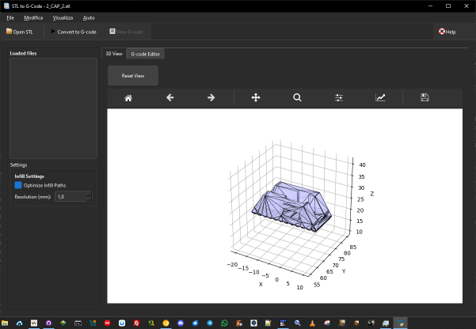

# STL to GCode Converter

A powerful Python application for converting STL files to G-code, designed for 3D printing and CNC machining. The application features a modern GUI built with **PyQt6**, numpy-stl for STL file processing, and matplotlib for high-quality 3D visualization.



## 🚀 Key Features

### 🖥️ Modern User Interface
- Built with PyQt6 for a native look and feel
- Dark theme with customizable styles
- Dockable panels for flexible workspace
- Responsive design that works on different screen sizes
- High DPI display support
- Comprehensive keyboard shortcuts

### 📚 Documentation
- Built-in markdown documentation viewer
- Accessible via Help menu or F1 key
- Support for multiple documentation files
- Syntax highlighting for code examples
- Table of contents navigation

### 📂 File Management
- Open and manage STL files
- Recent files menu for quick access
- File list display with status
- Support for multiple file formats
- Drag and drop support
- Auto-save functionality

### 🔍 3D Visualization & Simulation
- Interactive 3D preview with rotation and zoom
- G-code simulation with toolpath visualization
- Real-time simulation controls (play/pause/stop)
- Layer-by-layer simulation
- Simulation speed control
- Auto-scaling to fit models
- High-quality rendering with shading
- Multiple view angles
- Matplotlib integration with custom toolbar

### 📝 G-code Editing & Validation
- Built-in G-code editor with syntax highlighting
- Real-time syntax checking
- Printer compatibility validation
- Safety checks for temperatures and feedrates
- Support for custom start/end G-code
- G-code optimization algorithms
- Toolpath visualization
- Multiple view modes for G-code simulation
- Export simulation results

### 📊 Logging & Debugging
- Comprehensive logging system
- Logs stored in `stl_to_gcode-AAAA-MM-DD.log
- Log level configuration
- Built-in log viewer
- Debug information for troubleshooting

## 📦 Installation

### Prerequisites
- Python 3.8 or higher
- pip 23.0 or higher
- Git (for development)

### Installation Steps
1. Clone the repository:
   ```bash
   git clone https://github.com/Nsfr750/STL_to_G-Code.git
   cd STL_to_G-Code
   ```

2. Install dependencies:
   ```bash
   pip install -r requirements.txt
   ```

3. Run the application:
   ```bash
   python main.py
   ```

## 🛠️ Development

### Running Tests
```bash
pytest
```

### Building Documentation
```bash
cd docs
make html
```

## 🤝 Contributing

Contributions are welcome! Please read our [Contributing Guidelines](CONTRIBUTING.md) for details on our code of conduct and the process for submitting pull requests.

## 📄 License

This project is licensed under the GPLv3 License - see the [LICENSE](LICENSE) file for details.

## 📞 Support

For support, please open an issue on GitHub or join our [Discord server](https://discord.gg/BvvkUEP9).

## 🙏 Acknowledgments

- Thanks to all contributors who have helped improve this project
- Built with ❤️ by Nsfr750
