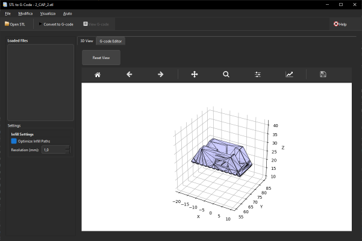

# STL to GCode Converter

A powerful Python application for converting STL files to G-code, designed for 3D printing and CNC machining. The application features a modern GUI built with **PyQt6**, numpy-stl for STL file processing, and matplotlib for high-quality 3D visualization.



## 🚀 Key Features

### 🖥️ Modern User Interface
- Built with PyQt6 for a native look and feel
- Dark theme with customizable styles
- Dockable panels for flexible workspace
- Responsive design that works on different screen sizes
- High DPI display support
- Comprehensive keyboard shortcuts

### 🔄 Automatic Updates
- Built-in update checker that notifies you of new versions
- Seamless GitHub integration for version checking
- Configuration stored in `config/updates.json`
- Automatic version detection from project files

### 📚 Documentation
- Built-in markdown documentation viewer
- Accessible via Help menu or F1 key
- Support for multiple documentation files
- Multi-language support

### 🛠️ Advanced Features
- Progressive STL loading for large files
- G-code preview with layer navigation
- Custom printer profiles
- Save/load print settings
- Support for multiple 3D printer firmwares

### 📂 File Management
- Open and manage STL files
- Recent files menu for quick access
- File list display with status
- Support for multiple file formats
- Drag and drop support
- Auto-save functionality

### 🔍 3D Visualization & Simulation
- Interactive 3D preview with rotation and zoom
- G-code simulation with toolpath visualization
- Real-time simulation controls (play/pause/stop)
- Layer-by-layer simulation
- Simulation speed control
- Auto-scaling to fit models
- High-quality rendering with shading
- Multiple view angles
- Matplotlib integration with custom toolbar

### 📝 G-code Editing & Validation
- Built-in G-code editor with syntax highlighting
- Real-time syntax checking
- Printer compatibility validation
- Safety checks for temperatures and feedrates
- Support for custom start/end G-code
- G-code optimization algorithms
- Toolpath visualization
- Multiple view modes for G-code simulation
- Export simulation results

### 📊 Logging & Debugging
- Comprehensive logging system
- Logs stored in `stl_to_gcode-AAAA-MM-DD.log
- Log level configuration
- Built-in log viewer
- Debug information for troubleshooting

## 📦 Installation

### Prerequisites
- Python 3.8 or higher
- pip (Python package manager)
- Git (for development)

### Installation Steps

1. **Clone the repository**
   ```bash
   git clone https://github.com/Nsfr750/STL_to_G-Code.git
   cd STL_to_G-Code
   ```

2. **Create and activate a virtual environment** (recommended)
   ```bash
   # On Windows
   python -m venv venv
   .\venv\Scripts\activate
   
   # On macOS/Linux
   python3 -m venv venv
   source venv/bin/activate
   ```

3. **Install dependencies**
   ```bash
   pip install -r requirements.txt
   ```

4. **Run the application**
   ```bash
   python main.py
   ```

## 🛠️ Development

### Project Structure
```
STL_to_G-Code/
├── assets/             # Application assets (icons, images, etc.)
├── config/             # Configuration files
├── docs/               # Documentation files
├── scripts/            # Python modules
│   ├── __init__.py
│   ├── gcode_editor.py # G-code editor implementation
│   ├── language_manager.py # Multi-language support
│   ├── log_viewer.py   # Log viewing functionality
│   ├── stl_processor.py # STL processing logic
│   ├── updates.py      # Update checking functionality
│   └── version.py      # Version management
├── tests/              # Test files
├── main.py             # Main application entry point
├── README.md           # This file
└── requirements.txt    # Python dependencies
```

### Building from Source

1. **Clone the repository**
   ```bash
   git clone https://github.com/Nsfr750/STL_to_G-Code.git
   cd STL_to_G-Code
   ```

2. **Set up development environment**
   ```bash
   python -m pip install --upgrade pip
   pip install -r requirements-dev.txt
   ```

3. **Run tests**
   ```bash
   pytest tests/
   ```

## 🤝 Contributing

Contributions are welcome! Please read our [Contributing Guidelines](CONTRIBUTING.md) for details on how to contribute to this project.

## 📄 License

This project is licensed under the GPLv3 License - see the [LICENSE](LICENSE) file for details.

## 📞 Support

For support, please open an issue in the [GitHub repository](https://github.com/Nsfr750/STL_to_G-Code/issues) or join our [Discord server](https://discord.gg/BvvkUEP9).

## 📜 Changelog

See [CHANGELOG.md](CHANGELOG.md) for a complete list of changes.
