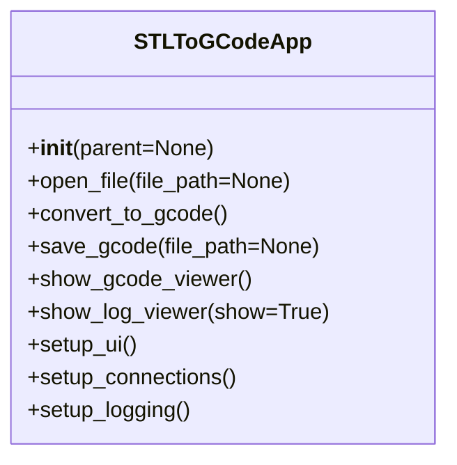
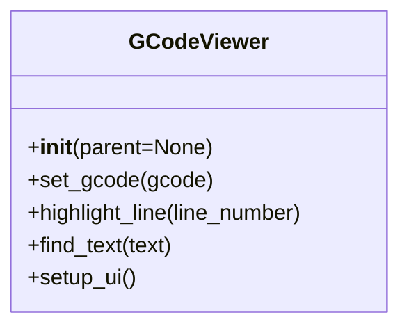
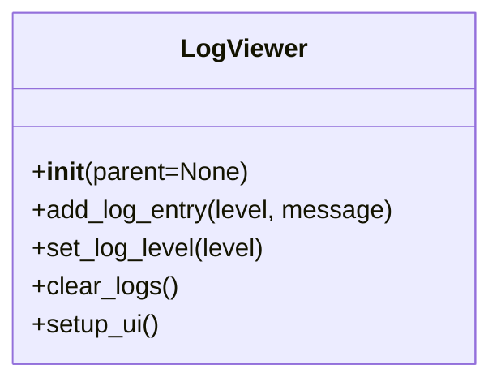
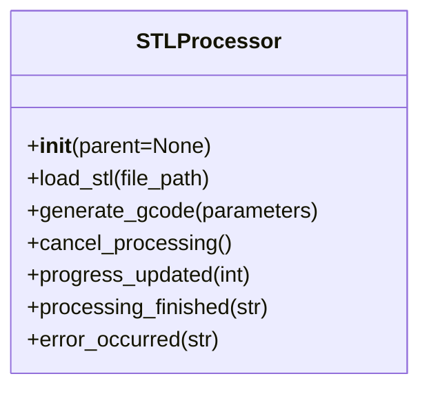
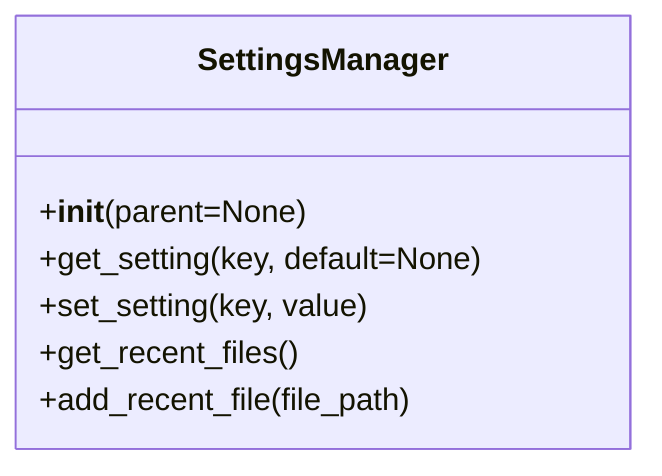
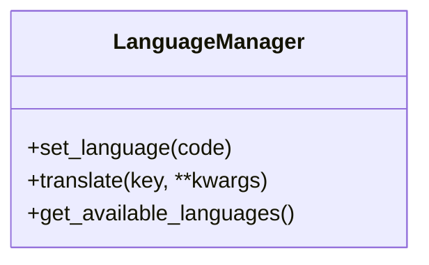

# 🔍 API Reference

> [!NOTE]
> Comprehensive API documentation for the STL to GCode Converter.

## 🏗 Core Application

### 🏛 `STLToGCodeApp` Class

Main application class that initializes and runs the STL to GCode Converter.



#### Key Methods

| Method | Description |
|--------|-------------|
| `__init__(parent)` | Initialize the main application window |
| `open_file(file_path)` | Open and load an STL file |
| `convert_to_gcode()` | Convert the loaded STL to G-code |
| `save_gcode(file_path)` | Save the generated G-code to a file |
| `show_gcode_viewer()` | Display the G-code viewer with the current G-code |
| `show_log_viewer(show)` | Show or hide the log viewer panel |
| `setup_ui()` | Initialize the user interface components |
| `setup_connections()` | Set up signal-slot connections |
| `setup_logging()` | Configure the logging system |

---

## 📊 UI Components

### 📈 `GCodeViewer` Class

Interactive G-code viewer with syntax highlighting.



#### Key Methods

| Method | Description |
|--------|-------------|
| `__init__(parent)` | Initialize the G-code viewer |
| `set_gcode(gcode)` | Set the G-code to display |
| `highlight_line(line_number)` | Highlight a specific line in the G-code |
| `find_text(text)` | Find and highlight text in the G-code |
| `setup_ui()` | Initialize the user interface components |

### 📝 `LogViewer` Class

Interactive log viewer with filtering capabilities.



#### Key Methods

| Method | Description |
|--------|-------------|
| `__init__(parent)` | Initialize the log viewer |
| `add_log_entry(level, message)` | Add a new log entry |
| `set_log_level(level)` | Set the minimum log level to display |
| `clear_logs()` | Clear all log entries |
| `setup_ui()` | Initialize the user interface components |

---

## 🤖 Utility Classes

### 📊 `STLProcessor` Class

Handles STL file processing and G-code generation.



#### Key Methods

| Method | Description |
|--------|-------------|
| `__init__(parent)` | Initialize the STL processor |
| `load_stl(file_path)` | Load an STL file for processing |
| `generate_gcode(parameters)` | Generate G-code from the loaded STL |
| `cancel_processing()` | Cancel the current processing operation |
| `progress_updated(int)` | Signal emitted when progress is updated |
| `processing_finished(str)` | Signal emitted when processing is finished |
| `error_occurred(str)` | Signal emitted when an error occurs |

### 📈 `SettingsManager` Class

Manages application settings and preferences.



#### Key Methods

| Method | Description |
|--------|-------------|
| `__init__(parent)` | Initialize the settings manager |
| `get_setting(key, default)` | Get a setting value |
| `set_setting(key, value)` | Set a setting value |
| `get_recent_files()` | Get the list of recently opened files |
| `add_recent_file(file_path)` | Add a file to the recent files list |

---

## 📝 Enumerations

### 🔍 `LogLevel` Enum

```python
class LogLevel(IntEnum):
    DEBUG = logging.DEBUG
    INFO = logging.INFO
    WARNING = logging.WARNING
    ERROR = logging.ERROR
    CRITICAL = logging.CRITICAL
```

### 📊 `ViewMode` Enum

```python
class ViewMode(Enum):
    SOLID = "Solid"
    WIREFRAME = "Wireframe"
    POINTS = "Points"
    X_RAY = "X-Ray"
```

---

## 📝 Signals

### 🔍 `ProcessingSignals` Class

```python
class ProcessingSignals(QObject):
    progress = pyqtSignal(int)  # Progress percentage (0-100)
    status = pyqtSignal(str)    # Status message
    finished = pyqtSignal()     # Processing finished
    error = pyqtSignal(str)     # Error message
```

---

## 📊 Constants

### 🔍 Default G-code Parameters

```python
DEFAULT_PARAMETERS = {
    'layer_height': 0.2,    # mm
    'print_speed': 60,      # mm/s
    'nozzle_temp': 200,     # °C
    'bed_temp': 60,         # °C
    'infill_density': 20,   # %
    'shells': 2,
    'retraction': True,
    'retraction_distance': 5.0,
    'retraction_speed': 45.0
}
```

### 🔍 Supported File Extensions

```python
SUPPORTED_EXTENSIONS = ['.stl', '.STL', '.gcode', '.gco', '.g']
```

### 🔍 Logging Format

```python
LOG_FORMAT = '%(asctime)s - %(name)s - %(levelname)s - %(message)s'
```

---

## 📋 Additional Notes

- All units in millimeters (mm)
- Angles in degrees
- Speeds in mm/s

## 🧩 Core Modules

### `language_manager.py` Module

Handles application internationalization.



### `gcode_viewer.py` Module

Interactive G-code visualization.

**Features:**

- 🎨 Syntax highlighting
- 🔍 Zoom/pan controls
- 📊 Layer visualization

---

## 📝 Example Usage

```python
# Create and show the main application window
app = QApplication(sys.argv)
window = STLToGCodeApp()
window.show()
sys.exit(app.exec())
```

---

## 📊 Dependencies

- PyQt6 >= 6.4.0
- numpy-stl >= 2.17.1
- matplotlib >= 3.5.0
- numpy >= 1.21.0
- packaging >= 21.0

---

## 📈 Versioning

This API follows [Semantic Versioning](https://semver.org/). The current API version is 2.0.0.

---

## 📝 License

This program is free software: you can redistribute it and/or modify
it under the terms of the GNU General Public License as published by
the Free Software Foundation, either version 3 of the License, or
(at your option) any later version.

This program is distributed in the hope that it will be useful,
but WITHOUT ANY WARRANTY; without even the implied warranty of
MERCHANTABILITY or FITNESS FOR A PARTICULAR PURPOSE.  See the
GNU General Public License for more details.

You should have received a copy of the GNU General Public License
along with this program.  If not, see <https://www.gnu.org/licenses/>.

For the full license text, see the [LICENSE](../LICENSE) file.
