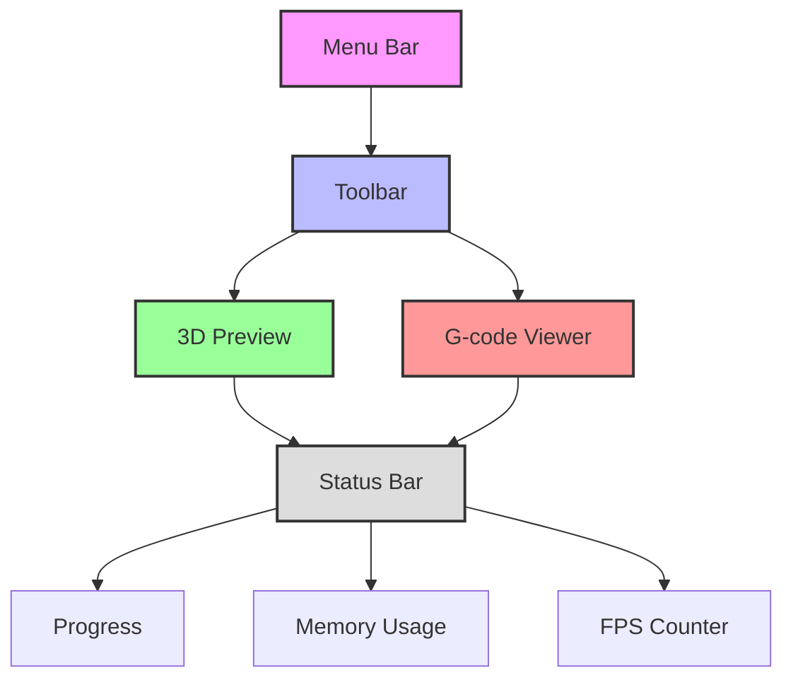

# User Guide

> [!TIP]
> Looking for quick answers? Try our [FAQ section](#frequently-asked-questions) or use `Ctrl+F` to search this page!

## Table of Contents

- [🖥️ Interface Overview](#interface-overview)
- [🛠 Basic Workflow](#basic-workflow)
- [⚡ Advanced Features](#advanced-features)
- [⌨️ Keyboard Shortcuts](#keyboard-shortcuts)
- [🔧 Troubleshooting](#troubleshooting)
- [❓ FAQ](#frequently-asked-questions)

---

## Interface Overview



### Main Components

#### 1. Menu Bar

- **File**: Open/Save projects, import/export files
- **Edit**: Undo/Redo, preferences
- **View**: Toggle panels, reset view
- **Tools**: Advanced utilities
- **Help**: Documentation and support

#### 2. Toolbar

| Icon | Function | Shortcut |
|------|----------|----------|
| 📁   | Open File | `Ctrl+O` |
| 💾   | Save G-code | `Ctrl+S` |
| 🔄   | Refresh View | `F5` |
| 🔍   | Zoom to Fit | `F` |

#### 3. 3D Preview

- Rotate: `Left-click + drag`
- Pan: `Right-click + drag`
- Zoom: `Mouse wheel`
- Reset view: `Home`

#### 4. G-code Viewer

```gcode
; Sample G-code preview
G28 ; Home all axes
G1 Z5 F5000 ; Lift nozzle
G1 X10 Y10 F3000 ; Move to start
```

---

## 🛠 Basic Workflow

### 1. Importing Models

- Click `File > Open` or drag-drop STL files
- Supported formats: `.stl`, `.obj`, `.3mf`
- Multiple files can be loaded simultaneously

### 2. Model Preparation

- Use the transform tools to position your model
- Check for potential printing issues
- Adjust print settings as needed

### 3. Generate G-code

1. Click the `Generate G-code` button
2. Monitor progress in the status bar
3. Preview the toolpath in the 3D view

### 4. Export & Print

- Save G-code to your computer
- Transfer to your 3D printer
- Or send directly to OctoPrint

---

## Advanced Features

### Custom Profiles

Create and save custom print profiles for different materials:

```python
{
  "profile_name": "PLA_Quality",
  "nozzle_temp": 210,
  "bed_temp": 60,
  "print_speed": 60,
  "retraction": {
    "enable": true,
    "distance": 5,
    "speed": 45
  }
}
```

### Post-Processing Scripts

Add custom G-code scripts to run before/after printing:

```gcode
; Start G-code
M140 S{material_bed_temperature} ; Set bed temp
M190 S{material_bed_temperature} ; Wait for bed
M104 S{material_print_temperature} ; Set nozzle temp
M109 S{material_print_temperature} ; Wait for nozzle
G28 ; Home all axes
G29 ; Auto bed leveling
```

---

## Keyboard Shortcuts

### Navigation

| Shortcut | Action |
|----------|--------|
| `WASD`   | Move camera |
| `Q/E`    | Rotate view |
| `R/F`    | Zoom in/out |
| `Space`  | Reset view |

### Model Manipulation

| Shortcut | Action |
|----------|--------|
| `G`      | Grab selected |
| `R`      | Rotate selected |
| `S`      | Scale selected |
| `Del`    | Delete selected |

---

## Troubleshooting

### Common Issues

#### 1. Model Won't Load

✅ **Solution**:

- Check file format (.stl, .obj, .3mf)
- Ensure file isn't corrupted
- Try repairing the mesh

#### 2. G-code Generation Fails

✅ **Solution**:

- Check model for errors
- Verify print settings
- Update to latest version

#### 3. Poor Print Quality

✅ **Solution**:

- Calibrate your printer
- Adjust layer height
- Check filament quality

---

## Frequently Asked Questions

### How do I update the software?

> [!NOTE]
> The application checks for updates automatically on startup. You can also manually check under `Help > Check for Updates`.

### Can I use custom G-code scripts?

> Yes! You can add custom start/end G-code in the printer settings.

### Is there a dark mode?

> Absolutely! Enable it in `Preferences > Appearance > Theme`.

### How do I report a bug?

> Please open an issue on [GitHub](https://github.com/Nsfr750/STL_to_G-Code/issues) with detailed steps to reproduce the problem.

### Is there a command-line interface?

> Yes! Run `python main.py --help` to see available command-line options.

---

## Additional Resources

- [API Documentation](api.md)
- [GitHub Repository](https://github.com/Nsfr750/STL_to_G-Code)

## Need Help?

- **Email**: [nsfr750@yandex.com](mailto:nsfr750@yandex.com)
- **Discord**: [Join our server](https://discord.gg/BvvkUEP9)